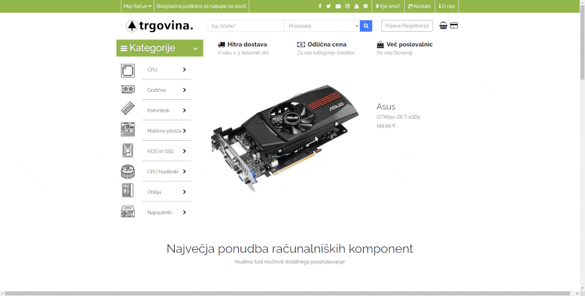
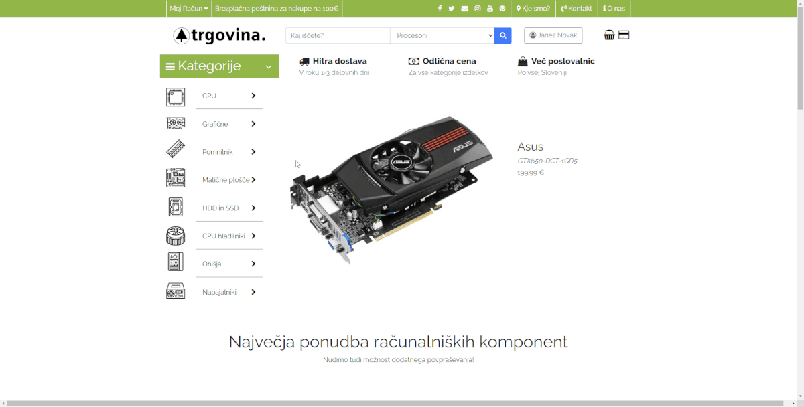

# E-trgovina

Spletna trgovina za prodajo računalniških komponent. Trgovina ponuja vse osnovne lastnosti spletne trgovine:
- Registracija in prijava uporabnikov
- Nakupovalna košarica
- Sortiranje in iskanje izdelkov po imenu in kategoriji
- Urejanje podatkov osebnega računa uporabnika
- Različne informacijske strani (Kontakt, O nas, itd.)
- Nakup izdelkov
- Izpis končnega računa v PDF obliki

Aplikacija je narejena iz sledečih frontend in backend tehnologij: HTML, CSS, BOOTSTRAP, PHP & MySQL.

## Namestitev

Za delovanje aplikacije potrebujete PHP in MySQL strežnik. Priporočam uporabo [XAMPP](https://www.apachefriends.org/) strežnika.
Po namestitvi kopirajte vso vsebino repozitorija v javni strežniški direktorij (v primeru xampp: *XAMPP_INSTALL_DIR/htdocs*). V 
primeru lokalne namestitve vključite strežnike in dostopajte do aplikacije preko brskalnika na naslovu [localhost](http://localhost).

## Zaslonski posnetki aplikacije

- Domača stran:

***
- Izbira izdelka:

